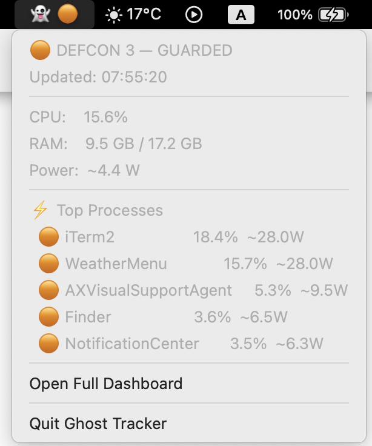
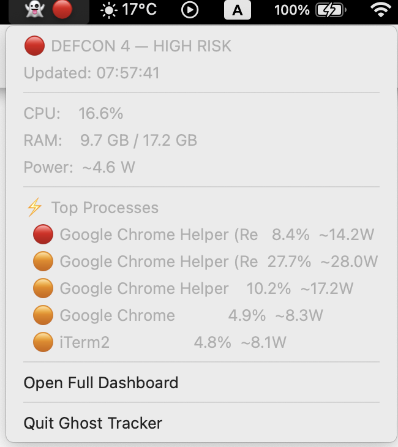

<div align="center">

# 👻 Ghost Resource Tracker

**Detect hidden cryptominers, malware, and stealth scripts by their power signature.**

*Activity Monitor shows* ***what*** *is running. Ghost Tracker reveals* ***what it costs.***

---

[](https://www.apple.com/macos/)
[](https://python.org)
[](LICENSE)
[](https://github.com/mhsn1/ghost-resource-tracker/actions)
[](https://github.com/mhsn1/ghost-resource-tracker/releases)

</div>

---
<div align="center">
  
  

</div>

---

## The Problem

Modern malware is invisible in Activity Monitor. It hides behind legitimate service names (`com.apple.WebKit`, `node`, `python3`), spawns short-lived child processes that vanish before you look, and throttles CPU just enough to avoid suspicion.

But it **cannot hide its power consumption**.

Ghost Tracker exposes hidden processes using a **Power-to-Process Ratio** combined with **Shannon entropy analysis** — a detection signal that no stealth technique can suppress without also stopping the attack.

---

## How It Works

```
Process CPU share  ×  System CPU power (W)  =  Estimated watts per process
```

A cryptominer at 80% CPU on a 28W MacBook draws ~6–8W from a single process. The system appears "normal" in Activity Monitor — but the power ratio exposes it immediately.

### Four Detection Signals

| Signal | Weight | Science | What It Catches |
|--------|--------|---------|-----------------|
| **Power draw** | 35% | `P = cpu_share × TDP` | Brute-force mining, encoding, exfiltration |
| **CPU entropy** | 25% | Shannon H = −Σ p log₂p | Sustained constant load (miner signature) |
| **Network × Power** | 20% | Correlation detection | Data exfiltration while computing |
| **Baseline z-score** | 20% | Welford's algorithm | Sudden behavioral anomalies |

### Shannon Entropy — The Key Insight

```
H(X) = −Σ p(xᵢ) · log₂(p(xᵢ))     [bits, range: 0 → 3.32]
```

| Process Type | CPU Pattern | Entropy | Verdict |
|---|---|---|---|
| Cryptominer | 85% constantly | ~0.1 bits | 🔴 Flagged |
| Web browser | 0–100% variable | ~3.1 bits | 🟢 Normal |
| Video player | 20–40% steady | ~1.8 bits | 🟡 Watch |

Ghost Tracker builds this profile for **every process** using a 30-sample rolling window.

---

## Features

- **DEFCON 1–5 threat classification** — military-style live threat display
- **Power-to-Process ratio** estimated for every running process
- **Shannon entropy scoring** identifies sustained constant-load signatures
- **Process genealogy tracking** — reveals parent → child chains malware hides in
- **Ghost process detection** — catches processes that spawn and die within seconds
- **Network × Power correlation** — double red flag for data exfiltration
- **Statistical baseline** — Welford's online algorithm, 30-sample rolling window per process
- **macOS native notifications** at configurable DEFCON threshold
- **JSONL alert log** — structured forensic output, SIEM-ready
- **One-shot JSON snapshot** export for scripting and incident response

---

## Installation

### Requirements
- macOS 12 Monterey or later
- Python 3.10+

### One-Line Install
```bash
curl -fsSL https://raw.githubusercontent.com/mhsn1/ghost-resource-tracker/main/install.sh | bash
```

### Manual Install
```bash
git clone https://github.com/mhsn1/ghost-resource-tracker
cd ghost-resource-tracker
python3 -m venv .venv
source .venv/bin/activate
pip install psutil rich
python3 -m ghost_tracker.cli
```

---

## Usage

```bash
# Start live dashboard (default settings)
ghost-tracker

# Lower threshold — flag anything over 3W
ghost-tracker --threshold 3.0

# Alert at DEFCON 3 and above (default: 4)
ghost-tracker --defcon 3

# Faster refresh for active incident response
ghost-tracker --refresh 0.5

# Export forensic JSON snapshot and exit
ghost-tracker --export-snapshot > snapshot_$(date +%s).json

# All options
ghost-tracker --help
```

---

## Dashboard

```
┌──────────────────────────────────────────────────────────────────┐
│  👻  GHOST RESOURCE TRACKER  ·  2026-03-20  06:18:25  ·  00:00:57 │
├────────────────────────────────────────┬─────────────────────────┤
│  System Health                         │  Threat Level           │
│  CPU  ███░░░░░░░░░░░░░░░  17.8%        │                         │
│  RAM  █████████████░░░░░  65.6%        │  DEFCON 1   SECURE      │
│  Power  1.1W CPU / 0.0W GPU / 1.1W     │  [████░░░░░░░░░░░░░░░░] │
├────────────────────────────────────────┴─────────────────────────┤
│  Process Monitor · 845 processes                                  │
│  PID    Process              CPU%  RAM MB  ~Watts  Entropy DEFCON │
│  4723   python3               0.8      26    0.22    2.91      1  │
│  399    Google Chrome         1.0     367    0.28    3.01      1  │
│  444    iTerm2                0.4      90    0.11    3.32      1  │
├──────────────────────────────────────────────────────────────────┤
│  👻 Ghost Process Log                                             │
│  No ghost processes detected this session                         │
└──────────────────────────────────────────────────────────────────┘
```

### DEFCON Levels

| Level | Color | Meaning | Action |
|-------|-------|---------|--------|
| DEFCON 1 | 🟢 Green | All clear | None needed |
| DEFCON 2 | 🟡 Yellow | Elevated activity | Monitor closely |
| DEFCON 3 | 🟠 Orange | Suspicious process | Investigate |
| DEFCON 4 | 🔴 Red | High confidence threat | Kill + audit |
| DEFCON 5 | ⚠️ Critical | Active attack signature | Immediate action |

---

## Alert Log Format

Alerts are written to `logs/alerts.jsonl` — one JSON object per line, SIEM-compatible:

```json
{
  "timestamp": "2026-03-20T06:18:42.111Z",
  "defcon": 4,
  "pid": 1337,
  "name": "node",
  "exe": "/usr/local/bin/node",
  "cpu_percent": 85.0,
  "estimated_watts": 6.8,
  "entropy": 0.18,
  "z_score": 4.7,
  "reasons": [
    "High power draw: 6.8W (threshold: 5W)",
    "Low CPU entropy: 0.18 bits (cryptominer pattern)",
    "Statistical anomaly: z-score 4.7σ from baseline"
  ]
}
```

---

## Testing

```bash
# Run test suite
pip install pytest
pytest tests/ -v

# Simulate a cryptominer to test detection
yes > /dev/null &
# Watch Ghost Tracker flag it within 30 seconds
kill %1
```

---

## Scientific Notes

**Power estimation accuracy**
Ghost Tracker uses a CPU-share heuristic when `powermetrics` is unavailable:
```
P_process ≈ cpu_share × TDP_device
```
Where `TDP_device = 28W` for MacBook Pro Intel, `~15W` for Apple Silicon M-series.
This is a proxy for anomaly detection, not a hardware billing meter.

**Entropy floor**
With fewer than 5 CPU samples, entropy defaults to `3.32 bits` (maximum, benign assumption) to prevent false positives during startup.

**Ghost threshold**
A process is logged as a ghost if it exits within 10 seconds of first observation. Adjust `GHOST_THRESHOLD` in `core.py` to tune sensitivity.

**Welford's online algorithm**
Numerically stable running mean and variance — critical for long-running sessions with thousands of samples per process.

---

## Roadmap

- [ ] Apple Silicon native power via `powermetrics` JSON
- [ ] Known malware process signature database
- [ ] CSV export for spreadsheet analysis
- [ ] Homebrew tap: `brew install ghost-tracker`
- [ ] `.pkg` installer for non-technical users
- [ ] Per-process network connection details

---

## Contributing

Contributions welcome. Please:
1. Add tests for any new detection heuristic
2. Document the mathematical basis in source comments
3. Keep `core.py` dependency-free (stdlib + psutil only)

See [CONTRIBUTING.md](CONTRIBUTING.md) for full guidelines.

---

## License

MIT — see [LICENSE](LICENSE).

---

<div align="center">

Built for security researchers and developers.<br>
Not a replacement for dedicated endpoint detection software.

**[Report a Bug](https://github.com/mhsn1/ghost-resource-tracker/issues) · [Request a Feature](https://github.com/mhsn1/ghost-resource-tracker/issues) · [Discussions](https://github.com/mhsn1/ghost-resource-tracker/discussions)**

</div>
